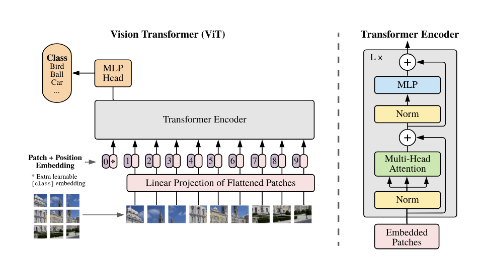

</img>

The Vision Transformer is a novel approach that applies the Transformer architecture, originally designed for natural language processing tasks, directly to sequences of image patches, bypassing the need for convolutional neural networks (CNNs). This method demonstrates that a pure transformer model can achieve excellent results on image classification benchmarks with fewer computational resources compared to traditional CNN-based models.


This repository contains implementations of the following paper in Pytorch:
<a href="https://openreview.net/pdf?id=YicbFdNTTy">Vision Transformer</a>.

I take inspiration from the following repository:  <a href="https://github.com/lucidrains/vit-pytorch?tab=readme-ov-file">vit-pytorch</a>

as well as the following video: <a href="https://www.youtube.com/watch?v=TrdevFK_am4">An Image is Worth 16x16 Words: Transformers for Image Recognition at Scale (Paper Explained)</a>.

## Install

```bash
$ pip install vit-pytorch
```

## Usage

```python
import torch
from vit_pytorch import ViT

v = ViT(
    image_size = 256,
    patch_size = 32,
    num_classes = 1000,
    dim = 1024,
    depth = 6,
    heads = 16,
    mlp_dim = 2048,
    dropout = 0.1,
    emb_dropout = 0.1
)

img = torch.randn(1, 3, 256, 256)

preds = v(img) # (1, 1000)
```

## Params

- image_size: Integer. Maximum dimension (width or height) of the image.
- patch_size: Integer. Size of image patches; image_size must be divisible by patch_size. Number of patches n = (image_size // patch_size)², and n must be > 16.
- num_classes: Integer. Number of classification classes.
- dim: Integer. Output tensor dimension after linear transformation.
- depth: Integer. Number of Transformer blocks.
- heads: Integer. Number of heads in the Multi-head Attention layer.
- mlp_dim: Integer. Dimension of the MLP (FeedForward) layer.
- channels: Integer, default is 3. Number of image channels.
- dropout: Float (0 to 1), default is 0. Dropout rate.
- emb_dropout: Float (0 to 1), default is 0. Embedding dropout rate.
- pool: String, either cls token pooling or mean pooling.

